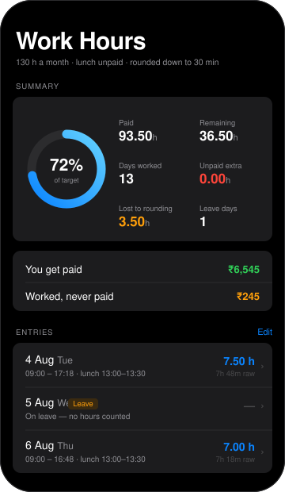

<div align="center">


# Work Hours

**Track daily work hours against a fixed monthly cap.**<br>
Lunch comes out of the middle of the day. Time rounds down. Nothing past the cap counts.

[](https://hanuman-adi.github.io/work-hours-tracker/)


<br>



</div>

---

## Why

Hourly arrangements with a monthly cap have three details that are easy to lose track of, and that generic time trackers get wrong:

| | |
| --- | --- |
| 🍽 | **Lunch is unpaid**, so it has to come out of the middle of the day — not off the end |
| ⬇️ | **Time rounds down** to the nearest half hour. 7 h 18 m pays as 7.0, not 7.3 |
| 🚫 | **Hours past the cap are worth nothing**, so overtime is invisible unless you track it |

Each quietly costs money. This makes all three visible instead of leaving them as a surprise at the end of the month.

## Features

| | |
| --- | --- |
| **Daily entries** | In, lunch start, lunch end, out |
| **Leave days** | Flip one switch to mark a date as leave — logged, but contributing no hours |
| **Live preview** | Raw vs. paid hours update as you type, before you commit anything |
| **Monthly summary** | Paid, remaining, days worked, leave days, hours past the cap, time lost to rounding, unpaid lunch |
| **Earnings** | What you'll actually be paid — and separately, the value of time you worked that was never counted |
| **Pace** | Hours per day needed across the days left to hit the target |
| **Bulk delete** | Edit mode ticks entries individually or all at once, then clears them in one go |
| **Overnight shifts** | An out time earlier than the in time rolls to the next day |
| **Appearance** | Light and dark, following Apple's system palettes |
| **Offline** | Installs to the home screen and opens with no signal |
| **Private** | Data never leaves the device — there is no server to send it to |

## The rounding rule

Worked time is `(out − in) − lunch`, floored to the nearest 30 minutes:

| Worked | Paid | |
| --- | --- | --- |
| 7 h 18 m | **7.0** | 18 min lost |
| 7 h 30 m | **7.5** | exact |
| 7 h 48 m | **7.5** | 18 min lost |
| 8 h 00 m | **8.0** | exact |

The whole rule is one line:

```js
const paidMinutes = e => Math.floor(rawMinutes(e) / 30) * 30;
```

## Configuring

The contract terms are two constants at the top of the script in `index.html`:

```js
const TARGET_H = 130, MONTHLY_PAY = 9100;
```

The hourly rate derives from them, and earnings stop climbing once `TARGET_H` is reached.

## How it works

**Storage.** Entries live in `localStorage`, keyed to the origin — so data is per-browser and per-device. The same URL in Safari and in Chrome keeps two separate sets, and phone and desktop don't sync. No account, no sync layer, by design.

**Time maths.** Times convert to minutes past midnight. Durations use a helper that adds 24 h when the end precedes the start, which is what makes overnight shifts and post-midnight lunch breaks work without special-casing.

**Validation.** Entries are rejected when only one of the two lunch times is filled, and when the lunch break comes out longer than the shift — which is what a swapped start/end looks like arithmetically.

**Offline.** A service worker caches the app shell with stale-while-revalidate: served from cache instantly, refreshed in the background, so launches are immediate and updates land on the next open.

**Interface.** Built on Apple's design language — the iOS system colour palette in both appearances, inset-grouped lists, hairline separators, native-style alert dialogs, an edit mode with multi-select, and Apple's animation curves. No CSS framework; roughly 500 lines of hand-written CSS driven by custom properties.

## Running locally

```bash
git clone https://github.com/Hanuman-Adi/work-hours-tracker.git
cd work-hours-tracker
```

Open `index.html`. That's the whole setup.

Offline support is the one thing that won't work that way — service workers need a secure context, so registration is skipped on `file://`. To test it, serve the folder over HTTP and visit `http://localhost:8000`, which counts as secure:

```bash
python -m http.server 8000
```

## Installing on a phone

Open the live URL, then **Share → Add to Home Screen**. You get an app icon, a fullscreen window with no browser chrome, and storage iOS won't clear after a week of not opening it — which a normal Safari tab is subject to.

## Browser support

Any current browser. Safari on iOS has no `<input type="month">`, so the month picker detects that and swaps itself for a month/year dropdown pair. Motion is disabled automatically under `prefers-reduced-motion`.

## Licence

MIT
